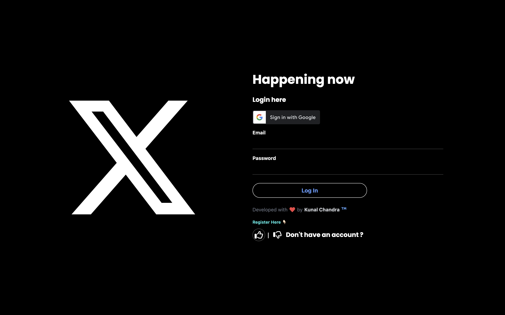
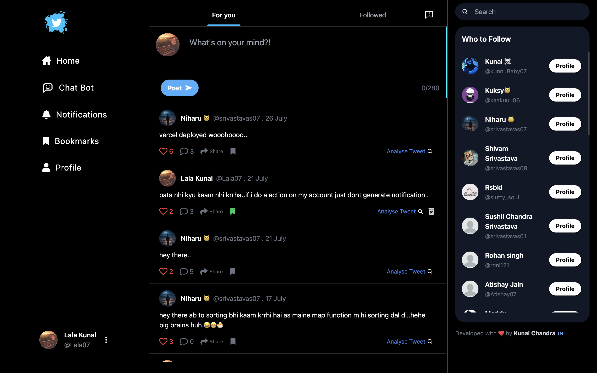
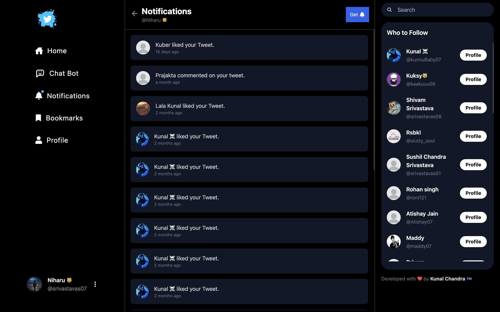
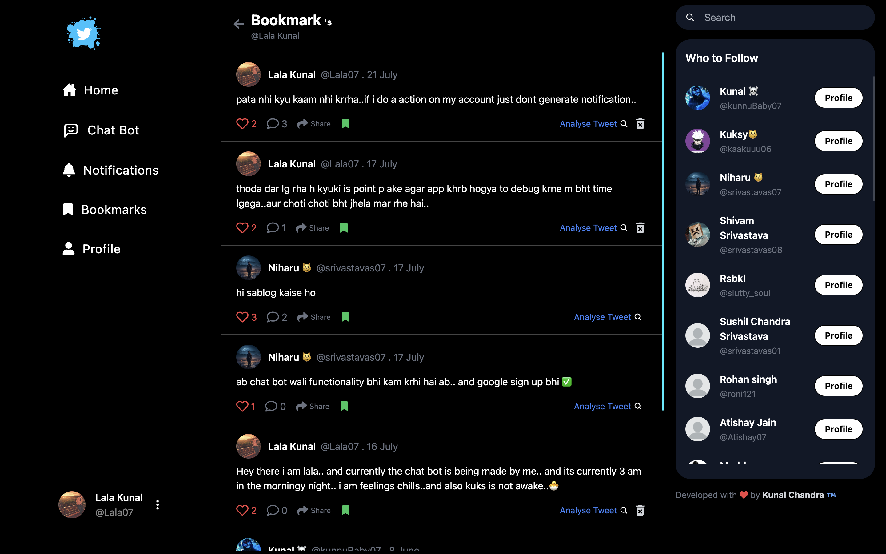
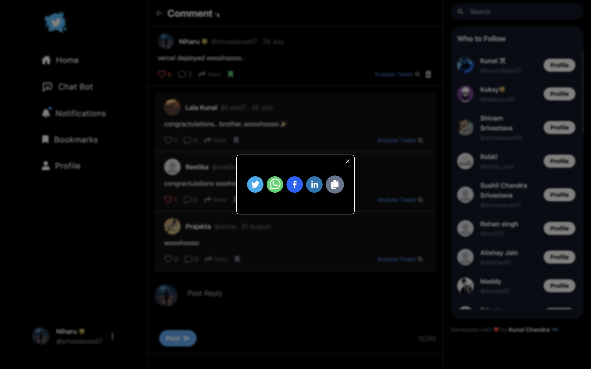
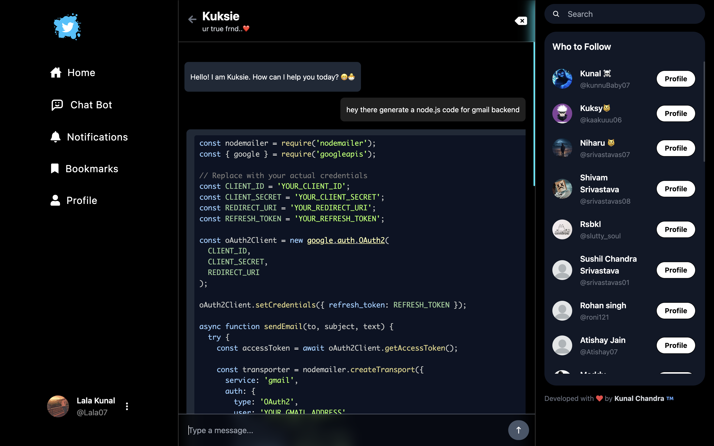
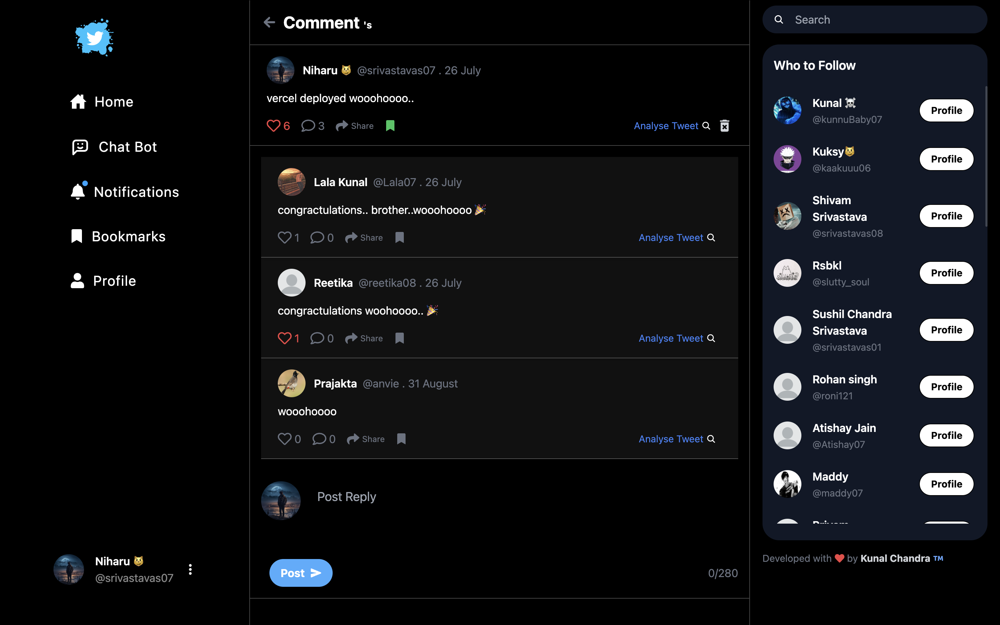
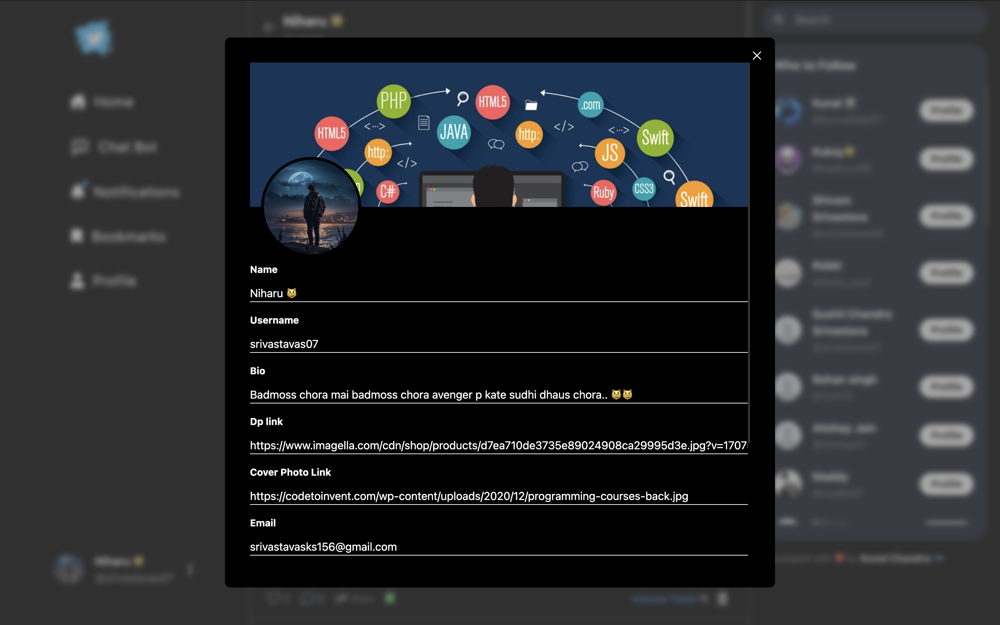
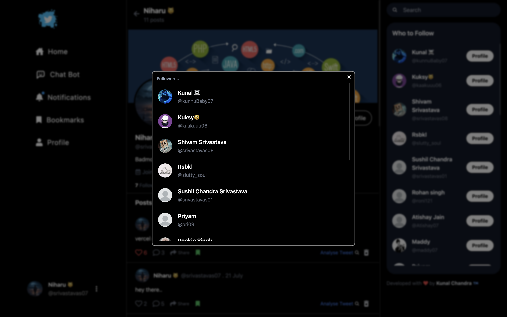
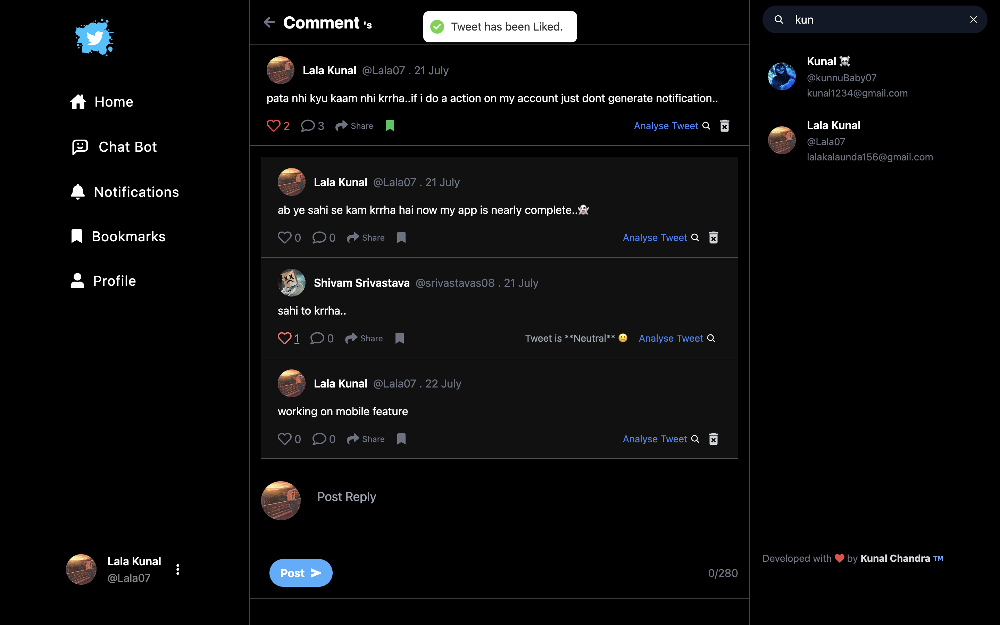

# Kwitter Application

## Table of Contents
- [Introduction](#introduction)
- [Features](#features)
- [Tech Stack](#tech-stack)
- [Setup and Installation](#setup-and-installation)
- [Environment Variables](#environment-variables)
- [Screenshots](#screenshots)

---

## Introduction
Kwitter is a fully functional Twitter clone, allowing users to post tweets, follow other users, and engage with content through likes and comments. In addition to the usual Twitter features, Kwitter provides:
- A **Chatbot** with context tracking, making conversations more intuitive and fluid.
- **Tweet Sentiment Analysis**, providing insights into whether a tweet conveys positive, negative, or neutral sentiments.

## Features
- **User Authentication**: Secure login/signup using JWT ,follow, unfollow etc.
- **Tweet Functionality**: Create, like, retweet, and reply to tweets, share, bookmark tweets and many more.
- **Follow/Unfollow Users**: Engage with other users by following or unfollowing them.
- **Chatbot with Context Tracking**: A chatbot that provides contextual replies and helps with navigation within the app.
- **Sentiment Analysis**: Analyze the sentiment of a tweet and display whether it’s positive, negative, or neutral.
- **Real-time Notifications**: Get notifications when someone interacts with your tweet.

## Tech Stack
### Frontend:
- **ReactJS**: UI Library
- **Redux**: State management
- **TailwindCSS**: For responsive and modern UI styling
- **AI_with_context**: Gemini Chat bot has the context of previous chats.

### Backend:
- **Node.js**: Server-side environment
- **Express.js**: Backend framework
- **MongoDB**: NoSQL database for storing user and tweet data
- **Gemini API**: For chatbot functionality
- **Sentiment Analysis API**: Analyzes the sentiment of tweets

## Setup and Installation
1. Clone the repository:
    ```bash
    git clone https://github.com/yourusername/kwitter.git
    cd kwitter
    ```

2. Install dependencies:
    ### For the backend:
    ```bash
    cd backend
    npm install
    ```

    ### For the frontend:
    ```bash
    cd frontend
    npm install
    ```

3. Create a `.env` file in both the frontend and backend directories and add the following environment variables.

### Environment Variables

#### Frontend `.env`:
```env
REACT_APP_SERVICE_ID= email_js_key
REACT_APP_TEMPLATE_ID= email_js_template_id
REACT_APP_API_KEY= email_js_api_key
REACT_APP_CLIENT_SECRET= your_google_client_secret
REACT_APP_CLIENT_ID= your_google_client_id
```
#### Backend `.env`:
```env
MONGO_URI= your_mongo_uri
TOKEN_SECRET= your_jwt_token_secret
GOOGLE_API_KEY= your_gemini_api_key
baseURL= http://localhost:3000

```
## API Endpoints

### User Routes Endpoint
 `/api/v1/user`

### Tweet Routes Endpoint
`/api/v1/tweet`

## Screenshots

### Login
  

### Home
  

### Notification
  

### Bookmark
  

### Share
  

### Chatbot
  

### Comment
  

### Edit
  

### Followers
  

### Liked by
  

### Search User and Analyze Sentiment
  

### Profile


